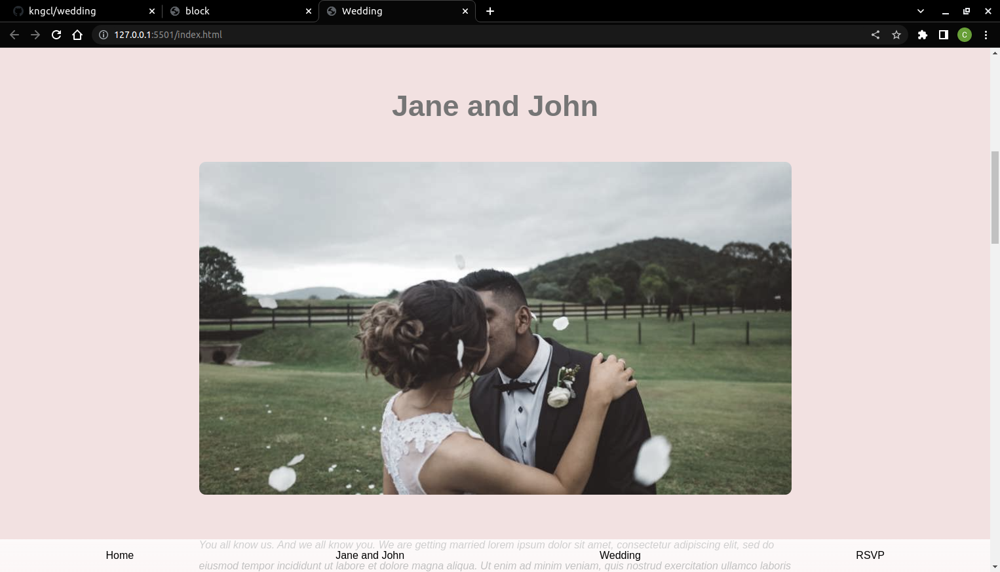
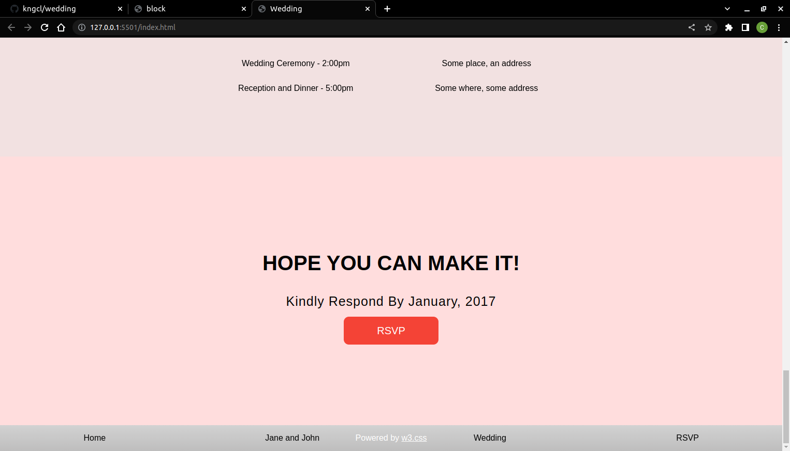

# wedding project

this project is all about online invitation.

## App

### Built With

- HTML
- CSS

## Clone project

- To get a local copy up and running follow these simple example steps.
- Clone this repository with `git@github.com:kngcl/wedding.git` using your terminal.
- Change to the project directory by entering: cd food in the terminal.

## steps

- $ git clone `git@github.com:kngcl/wedding.git`
- $ `cd wedding`
- $ `git checkout feature`

## Start App

- run `npm install`
- run `npm start` in your CLI

## Test

- run `npm run test` to run test

## Author

👤 **kngcl**

- GitHub: [@kngcl](git@github.com:kngcl/wedding.git)

## 📝 License (optional)

This project is [w3school](./LICENSE) licensed.
