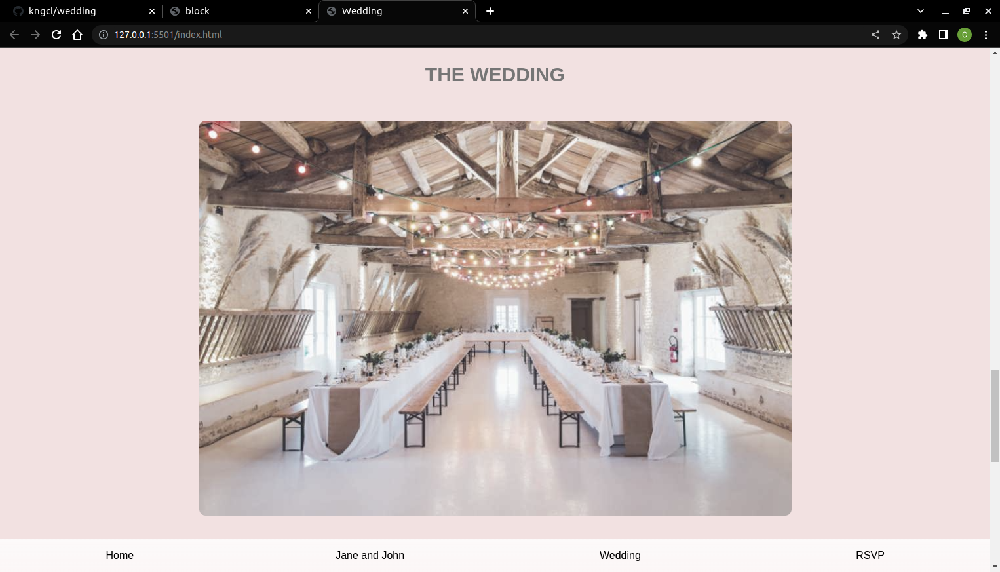

# wedding project

this project is all about online invitation.
The landing page has five sections headers, home, wedding, RSVP, jane-john and footer sections. The landing page actually serves as an invitation to people.

## App

### Built With

- HTML
- CSS
  
### Prerequisites

Knowledge about:

- HTML
- CSS
- Google chrome

## Clone project

- To get a local copy up and running follow these simple example steps.
- Clone this repository with `git@github.com:kngcl/wedding.git` using your terminal.
- Change to the project directory by entering: cd wedding in the terminal.

## steps

- $ git clone `git@github.com:kngcl/wedding.git`
- $ `cd wedding`
- $ `git checkout feature/header`

## Start App

- run by opening the index.html in the browser

## Author

👤 **kngcl**

- GitHub: [@kngcl](git@github.com:kngcl/wedding.git)

## 📝 License

This project is [w3school](./LICENSE) licensed.
